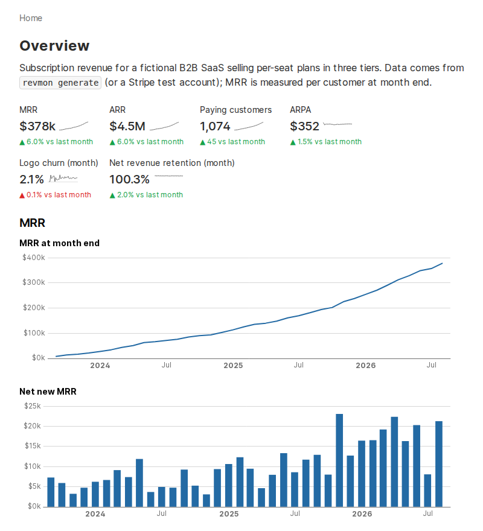
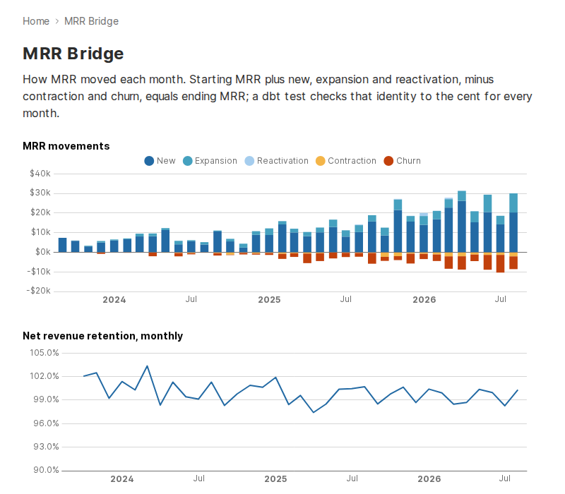
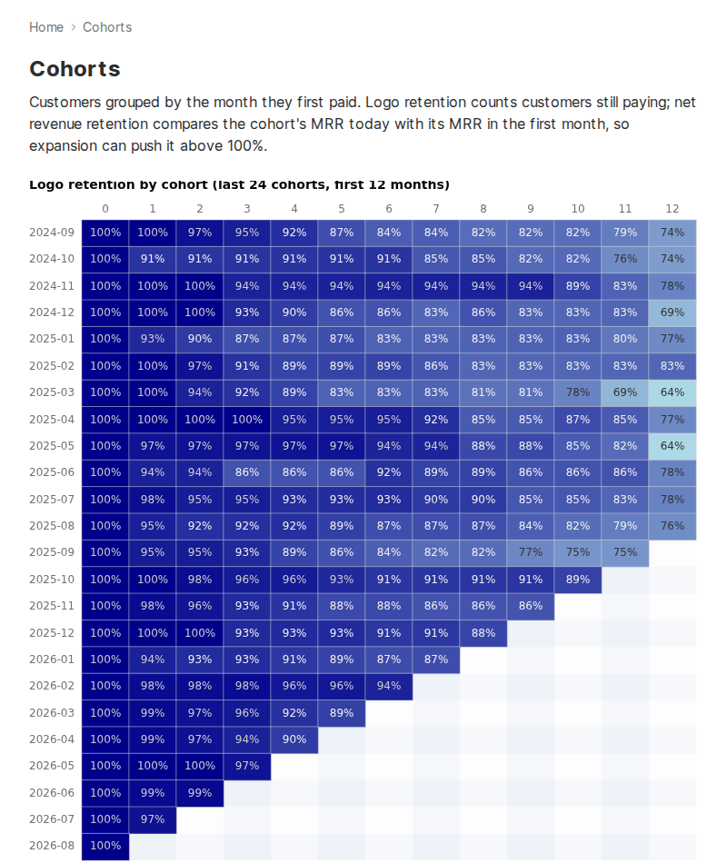

# RevenueMonitor

SaaS revenue analytics on Stripe-shaped billing data. DuckDB, dbt, MetricForge, Evidence.

A seeded generator simulates three years of a per-seat B2B SaaS (signups, trials, upgrades,
failed payments, churn, comebacks) as Stripe objects and events. dbt rebuilds subscription
history from the events, measures MRR per customer at every month end, and classifies each
change into an MRR bridge. The same numbers are defined as metrics in
[MetricForge](https://github.com/m4dd0ck/metricforge) and shown in an Evidence dashboard.
Everything runs locally with no accounts. A Stripe test-mode loader is included for real API data.

**Live dashboard: [m4dd0ck.github.io/revenue-monitor](https://m4dd0ck.github.io/revenue-monitor/)**
(rebuilt from the seed by GitHub Actions on every push; filters and charts run in your browser)



## Stack

| Tool | Role |
|------|------|
| Python + Pydantic | Data generator, Stripe test-mode extractor, raw loader, `revmon` CLI |
| DuckDB | Warehouse (single local file) |
| dbt | Staging → SCD2 history → MRR fact → marts, 60+ data tests |
| MetricForge | YAML metric definitions (MRR, ARPA, churn, NRR) queried from the CLI |
| Evidence.dev | SQL + Markdown dashboard, five pages |
| uv, ruff, mypy, pytest | Tooling |

## How it works

```
revmon generate ─┐
                 ├─▶ data/raw/<object>/*.jsonl ─▶ revmon load ─▶ raw.* (JSON payloads)
revmon stripe ───┘                                                    │
                                                                      ▼
                     staging ─▶ dim_subscription_history (SCD2 from events)
                                          │
                                          ▼
                              fct_customer_mrr_monthly ─▶ marts ─▶ Evidence
                                          │
                                          └──────────▶ metrics/revenue.yaml ─▶ revmon metrics
```

Raw tables keep the untouched JSON so a new or renamed Stripe field never breaks the load;
parsing happens in dbt staging.

## Data model

### Layers

| Layer | Purpose | Materialization |
|-------|---------|-----------------|
| staging | Parse JSON payloads, dedupe repeated pulls, epoch → UTC timestamps | View |
| intermediate | Subscription versions from events; MRR per customer per month end | View |
| dimensions | Customers, plans, dates, SCD2 subscription history | Table |
| facts | Monthly customer MRR with movements, invoices, payments | Table |
| marts | Dashboard-ready aggregates in dollars | Table |

### Models

**Dimensions**
- `dim_customer` — firmographics (country, industry, company size) from Stripe metadata
- `dim_plan` — one row per price with tier and monthly-normalised seat price
- `dim_date` — calendar spine
- `dim_subscription_history` — SCD Type 2, one row per subscription state from event snapshots

**Facts**
- `fct_customer_mrr_monthly` — one row per customer per month: starting and ending MRR, the
  movement that explains the change, churn type
- `fct_invoices`, `fct_payments` — billing and cash, refunds netted per charge

**Marts**
- `mart_mrr_bridge` — monthly starting MRR, movements, ending MRR, ARR, customer counts, rates
- `mart_cohort_retention` — logo and net revenue retention by first-paid-month cohort
- `mart_plan_summary` — customers, MRR and ARPA by tier and billing interval
- `mart_churn_analysis` — voluntary vs involuntary churn by tier
- `mart_customer_health` — current state per customer with an at-risk flag

### Tests worth pointing at

- `assert_mrr_bridge_reconciles` — starting MRR + movements = ending MRR, every month, to the cent
- `assert_starting_equals_prior_ending` — no gaps or jumps in any customer's monthly series
- `assert_current_version_matches_subscription` — replaying events lands on each
  subscription's current state

## Metric definitions

These are the rules the SQL implements.

- **Money** is integer cents until the marts, which convert to dollars.
- **MRR** for a subscription = seat price × seats, divided by 12 for annual plans, less any
  percentage discount active at the moment of measurement.
- **Status:** `active` and `past_due` count toward MRR (a past-due customer is still a customer
  until the subscription is canceled). `trialing`, `canceled`, `unpaid`, `incomplete` and
  `paused` count as zero.
- **When:** MRR is measured per customer at the end of each month, using the subscription
  version in force just before the next month starts. Mid-month changes count from the month
  they happen in; there is no proration.
- **Movements** compare a customer's MRR at consecutive month ends:

  | Previous | Current | Movement |
  |----------|---------|----------|
  | 0 | > 0, never paid before | new |
  | 0 | > 0, paid before | reactivation |
  | > 0 | 0 | churn |
  | > 0 | higher | expansion |
  | > 0 | lower | contraction |

- **Involuntary churn** is a subscription canceled with `cancellation_details.reason =
  payment_failed` (dunning ran out). Everything else is voluntary.
- **ARPA** = MRR / paying customers.
- **Logo churn rate** = churned customers / customers paying at month start.
- **Gross revenue churn** = (churned + contraction MRR) / starting MRR.
- **Net revenue retention (monthly)** = month-end MRR from customers who were paying at month
  start / starting MRR. Cohort NRR compares a cohort's MRR with its first paid month.
- **Cohort** = the month a customer first had MRR, not the signup month, so trials do not
  dilute retention. Reactivated customers stay in their original cohort.

## Dashboard pages

1. **Overview** — MRR, ARR, customers, ARPA, churn and NRR with month-over-month change; MRR
   and customer trends
2. **MRR Bridge** — stacked movements per month, retention rates, bridge table
3. **Cohorts** — logo and revenue retention heatmaps, average retention curve
4. **Plans** — MRR and ARPA by tier, annual billing mix
5. **Churn** — voluntary vs involuntary churn, churn by tier, at-risk customer list

| MRR Bridge | Cohorts |
|---|---|
|  |  |

## Quick start

Needs Python 3.12+, [uv](https://github.com/astral-sh/uv) and Node 18+.

```bash
make build            # uv sync + npm ci
make all              # generate → load → dbt build → dashboard sources (~10s)
make metrics          # MetricForge metrics in the terminal
make dashboard-dev    # Evidence at http://localhost:3000/revenue-monitor
```

Or step by step:

```bash
uv run revmon generate --seed 42 --start 2023-09-01 --end 2026-08-31
uv run revmon load
uv run dbt build --profiles-dir .
uv run revmon metrics --last 6
uv run revmon metrics --metrics total_mrr,gross_mrr_churn_rate,arpa
uv run mf show-sql arpa --dir metrics/ --dimensions month     # the SQL MetricForge runs
```

```
                               Revenue metrics
┏━━━━━━━━━┳━━━━━━━━━━┳━━━━━━━━━━━━━┳━━━━━━━━━━━┳━━━━━━┳━━━━━━━━━━━━┳━━━━━━━━┓
┃ Month   ┃      MRR ┃ Net new MRR ┃ Customers ┃ ARPA ┃ Logo churn ┃    NRR ┃
┡━━━━━━━━━╇━━━━━━━━━━╇━━━━━━━━━━━━━╇━━━━━━━━━━━╇━━━━━━╇━━━━━━━━━━━━╇━━━━━━━━┩
│ 2026-06 │ $348,597 │     $20,278 │       982 │ $355 │       1.9% │ 100.0% │
│ 2026-07 │ $356,645 │      $8,048 │     1,029 │ $347 │       2.0% │  98.3% │
│ 2026-08 │ $377,895 │     $21,251 │     1,074 │ $352 │       2.1% │ 100.3% │
└─────────┴──────────┴─────────────┴───────────┴──────┴────────────┴────────┘
```

Tests:

```bash
make lint             # ruff + mypy
make test             # unit tests (~2s)
make test-all         # plus the end-to-end pipeline test
```

## The generated data

A fictional company selling per-seat plans: Starter $29, Growth $59, Scale $99 per seat per
month, annual at ten times monthly. With the default seed it produces about 1,860 customers,
11,000 invoices and 5,200 subscription events.

- Signups grow ~4% a month with B2B seasonality (strong January and September, quiet December)
- 60% start with a 14-day trial; 55% of trials convert
- Company size drives seats and tier choice
- Seat changes and tier upgrades or downgrades happen mid-month
- Churn is decided at renewal: monthly plans every month, annual plans once a year
- 2.5% of payments fail; 70% recover within two weeks, the rest are canceled after 21 days
- 8% of voluntarily churned customers come back within six months
- Launch and partner coupons, a few refunds

Probabilities were tuned so the output looks like a healthy SMB product: ~2% monthly logo
churn, ~92% twelve-month net revenue retention, involuntary churn about a quarter of all churn.
The same seed always produces identical data.

## Using Stripe test mode (optional)

```bash
uv sync --extra stripe
export STRIPE_API_KEY=sk_test_...
uv run revmon stripe      # instead of revmon generate
uv run revmon load && uv run dbt build --profiles-dir .
```

Only test-mode keys are accepted. Pulls are incremental by `created` and land in the same raw
layout as the generator. Limits worth knowing:

- Stripe keeps events for 30 days. Subscriptions with no events fall back to a single version
  from their current state, so older plan changes are not visible.
- Discounts inside event snapshots are IDs, not objects, so historical discounts from Stripe
  are not applied to MRR.
- MRR reads the first subscription item; a data test fails if a multi-item subscription shows up.

## Project structure

```
revenue-monitor/
├── src/revenue_monitor/
│   ├── generator/       # catalog, lifecycle + events, billing, customer journeys
│   ├── models.py        # Pydantic models for Stripe objects
│   ├── loader.py        # raw JSONL → DuckDB
│   ├── stripe_source.py # Stripe test-mode extractor
│   ├── metrics.py       # MetricForge queries
│   └── cli.py           # revmon
├── models/              # dbt: staging, intermediate, dimensions, facts, marts
├── macros/              # schema naming, timestamps, subscription parsing
├── data_tests/          # singular dbt tests
├── metrics/             # MetricForge definitions
├── dashboard/           # Evidence project
├── tests/               # pytest
├── dbt_project.yml
├── profiles.yml
└── Makefile
```

## License

MIT
